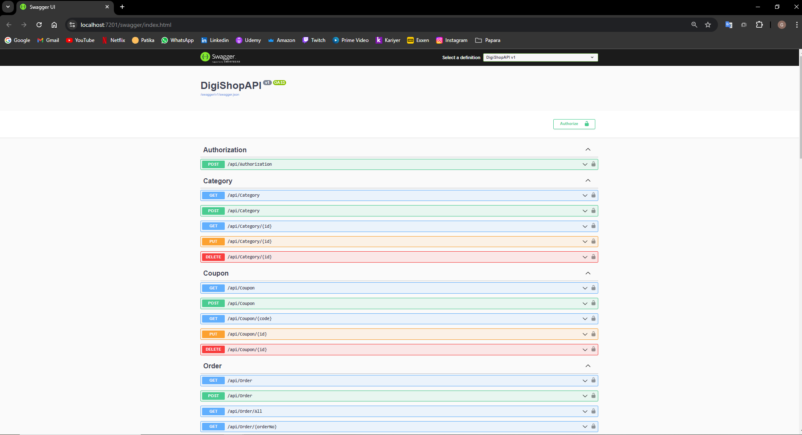

# Patika.dev & Papara .Net Bootcamp Final Project
This project is a digital product sales platform developed as part of the Patika.dev & Papara .Net Bootcamp. The platform is designed to operate across three channels: Android, iOS, and Web. Users can register, purchase digital products or licenses, and benefit from a loyalty system that rewards them with points for their purchases.

# Project Overview
The primary goal of this project is to create a platform that sells digital products and licenses. The system supports two types of users: regular users and admin users. Regular users can browse and purchase products, while admin users manage the product inventory, categories, and discount coupons.

# Key Features

User Management:
Regular users can register, log in, and manage their accounts.
Admin users can manage product listings, categories, and user accounts.

Product Management:
Admin users can add, update, delete, and categorize products.
Products have filterable properties.
Each product can offer loyalty points, which users can redeem in future purchases.

Coupon System:
Admins can create unique discount coupons that users can apply during checkout.
Coupons have an expiration date and can only be used once.
Coupons and loyalty points can be combined during checkout.

# Tech Stack
- Database: MSSQL
- Authentication: JWT Tokens
- ORM: Entity Framework with Repository and Unit of Work patterns
- API Documentation: Swagger

# Getting Started
## Prerequisites
- .NET Core SDK (version 8.0 or later)
- MSSQL

## Installation
### 1. Clone the repository
- https://github.com/gkberkay/papara-graduation-project.git
- cd papara-gradution-project

### 2. Set up the database
- Create a new database in PostgreSQL or MSSQL.
- Update the connection strings in appsettings.json with your database credentials.

### 3. Run the migrations
- dotnet ef database update

# Project Structure
### 1. DigiShop.Base
- Contains core components, utilities, and foundational classes that are used across the project.
### 2. DigiShop.Bussiness
- Houses the business logic layer, where the main application logic is implemented, including services for user management, product handling, and order processing.
### 3. DigiShop.Data
- Manages data access, including database connections, repositories, and Entity Framework models. All database-related operations are handled here.
### 4. DigiShop.Schema
- Contains data schemas, DTOs (Data Transfer Objects), and other data structures used by the API. It defines the models for data exchange between the API and the database.
### 5.DigiShopAPI
- The API layer of the application, containing controllers and route definitions. It handles incoming requests and interacts with the business and data layers to provide responses.

# Acknowledgements
- Patika.dev for organizing the bootcamp.
- Papara for sponsoring the project.
- Special thanks to the mentors and peers who provided guidance throughout the development process.

